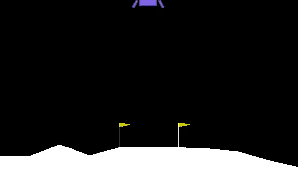

# Lunar-Lander
In 2013, a deep learning model successfully learned control policy directly from high-dimensional sensory input.  
The model was applied to seven Atari 2600 games from the Arcade Learning Environment. It surpassed human experts in four of them. ![[paper]](https://www.cs.toronto.edu/~vmnih/docs/dqn.pdf) 
Since then various deep learning method has been applied to reinforcement learning. Here i used OpenAI gym environment and used DQN to solve lunar lander. This is the last exercise Andrew Ng's ML specialization. See the trained network in action below :)   

  

